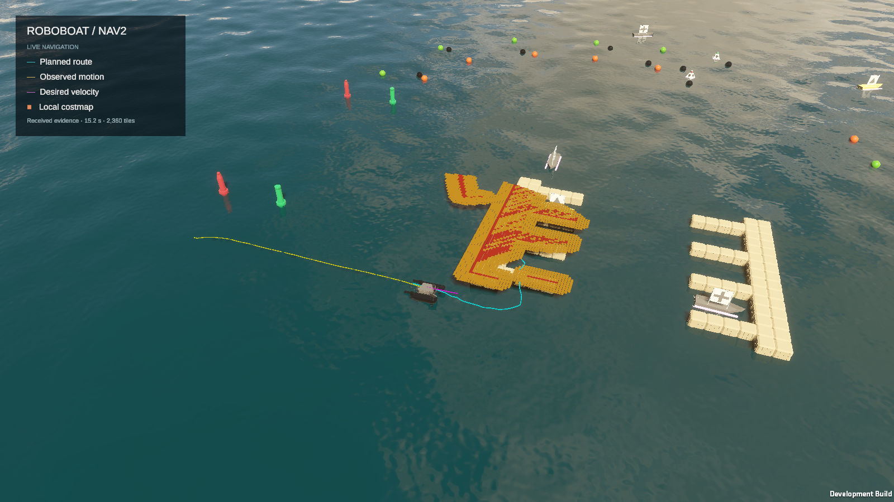

# First-dock image and evidence-bound explanation

The boat approaches the first dock near occupied and inflated costmap cells.
Nav2 predicts a collision along the commanded motion, aborts `FollowPath`, clears
the local costmap, and restarts control. The user observed a dock collision,
but retained physical-contact telemetry reports zero prohibited contacts.
The evidence confirms a collision prediction and recovery; actual impact remains
unconfirmed. Impact force and thruster causation cannot be inferred.

The [explanation JSON](../artifacts/nav2-docking-reproduction-20261002/review-capsule/explanation.json)
maps each claim to the real image, its source-message sidecar, the controller
log excerpt, and independent verification report. The log prediction and image
are separate timestamps in the same run: the photo request was approximately
6.68 wall seconds before the prediction at 2026-10-03T02:32:39.108Z.
This is not a synchronized impact photo.
Dense costmap tiles obscure portions of the hull and dock, so apparent overlap
is insufficient to establish physical contact. This is a grounded language
explanation artifact, not a claim that an online NLP service generated it.

The run subsequently met the measured five-second first-slip predicate, including
projected hull containment, but failed the unchanged timing harness with 54
stale/rejected actions. It must not be advertised as a fully valid benchmark or
as confirmed collision-free navigation.
