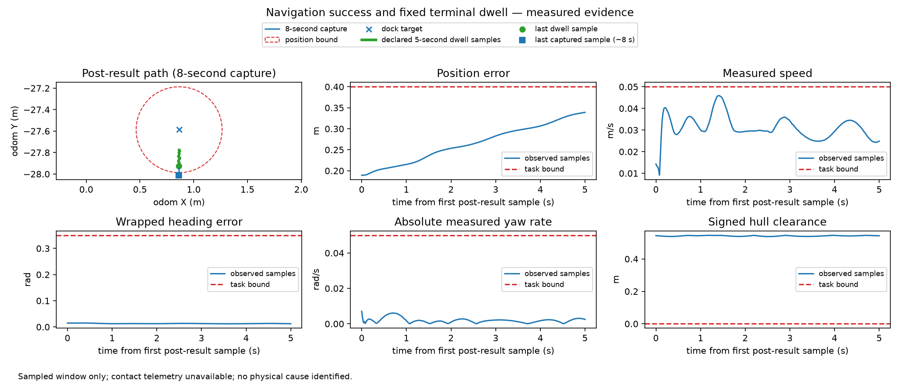

# Explicit-contact-contract development replay — complete results

All twelve new response/evidence instances have finalized current-binding support labels. This is inspected development reissuance of two existing settling recordings, adding zero recordings or independent configuration clusters. The broader pilot remains seven valid fresh recordings in three approach clusters, with two original complete tolerance pairs. Confirmation/replication N=0 and marine alpha=0. Nothing is pooled with land or promoted into a confirmatory primary endpoint.

| Measure | Strong repository/tool agent B2 | Deterministic contact-v2 renderer B4 |
|---|---:|---:|
| Strict common/extended development successes | 5/6 | 6/6 |
| Common units communicated | 24/24 | 24/24 |
| Answerable sampled-compliance intervals communicated | 2/2 | 2/2 |
| Generation calls | 6 | 0 |
| Mean answer characters | 663.0 | 715.7 |

Pass A, pass B and final judgments give the same scores. Twenty-four support passes plus three disagreement-only adjudications completed: 27 valid calls, zero retries/timeouts. Three unqualified abstraction disagreements are retained and excluded; no claim/unit/limitation disagreement. Perfect same-family agreement does not eliminate correlated error, and labels are agent-assessed, not human validation. The material-primary mapping and the failed newer contact/scope qualification gates remain unqualified/failed; no retrospective passing score is created.

The single strict B2 failure is a temporal endpoint mismatch in supplemental radial-error growth. The answer states “Radial error nevertheless grew by 0.1482 m through the dwell.” Independent Euclidean arithmetic yields 0.1481620508 m from result-adjacent observation (191.202385154 s) to last dwell sample (196.222383376 s), but 0.1483069925 m from first dwell sample (191.222385147 s) to last. These round to 0.1482 and 0.1483 m respectively. The endpoint difference is 0.0001449417 m with a 0.020 s starting-time offset. Both judge passes identify it, and the label/strict failure stays intact.

The discrepancy does not change observed position compliance, unknown contact/full task outcome, positive sampled information or the decisive evidence about the navigation/docking gap. It therefore does not establish a material useful-outcome advantage. No p-value, confidence interval, independent-cluster effect or superiority claim is reported. The proposed no-material-unsupported-assertion primary remains a prospective qualification problem; the strict score is a separately locked sensitivity, not a substitute primary. Do not redefine materiality after seeing this error or loosen the baseline.

The v2 public contact restriction resolves the earlier undefined flag without adding contact observations or altering other task requirements. Both methods receive identical public packets, complete executable certificate/renderer sources, primitives and the same effective YAML derived from node/plugin-specific pre-action checker readback. Remaining settings are declared launch configuration; no universal runtime-consumption claim. The baseline used scripts/tools in every call and had full access to the renderer. All L0/L1 answers distinguish action success from unestablished fixed-dwell completion; both L2 answers communicate sampled kinematic/hull compliance while retaining unknown contact and continuous-time limits. No actual compound docking success or identified wave/current/wind cause is established.

The known-route five-second dwell [248.4202697, 253.4202697] contains 251 compliant kinematic/hull samples, maximum gap approximately 0.020 s. Maximum position error is 0.339097506 m and speed is 0.045897197 m/s; minimum corresponding margins are 0.060902494 m and 0.004102803 m/s. Contact remains unknown. The longer capture crosses the 0.400 m position bound at 255.460267205 s (0.400286164 m), outside the predeclared dwell. That later crossing does not falsify the earlier sampled interval or identify its physical cause.

The existing evidence panel separates the fixed dwell from the longer capture. All quantities are retrospective simulator observations; they do not prove continuous-time compliance or a causal disturbance. L3 remains absent because genuine robot-visible contact/actuation evidence is unavailable. Numerical/temporal certificate checks and removal-only ladders pass; all twelve response rounded-value/unit audits pass. Numeric membership alone failed to catch the temporal association error, illustrating why complete support packets are necessary.

Baseline generation took 479.0 total seconds (mean 79.8, range 63.6–103.6), one call at a time, zero retries. Provider USD costs are unavailable. Character count and latency are descriptive tradeoffs, not new winning endpoints. A hypothetical 600-answer baseline phase at this mean takes about 13.3 serial hours before captures, extraction, annotation and failures; this is measured throughput extrapolation, not resource allocation or power justification.

Authoritative artifacts: `artifacts/roboboat-contact-policy-support-v2/development-results-v2.json`, `complete-call-accounting.json`, `growth-scope-reference-v1.json`; `artifacts/roboboat-contact-policy-inventory-v2/project-review-summary.json` (eleven source-text inventories, 226 atoms); complete same-source response bank and immutable packet/configuration hashes. Commands and integration boundaries are in EXPERIMENTS and INTEGRATION. Next: isolated publication, then prospective materiality/citation qualification and coordinated untouched design/resources before any confirmation.
