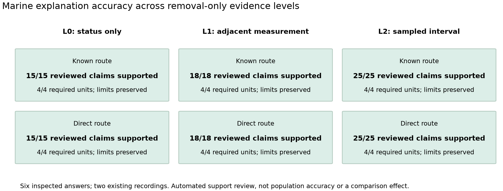
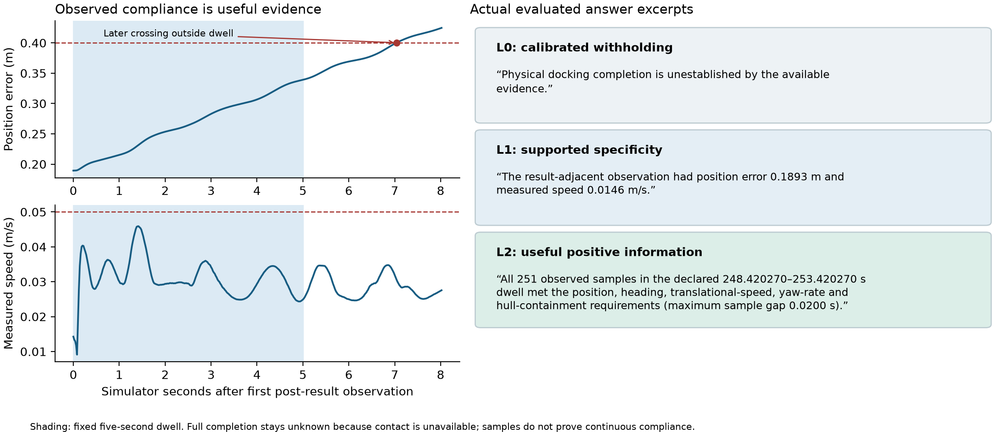
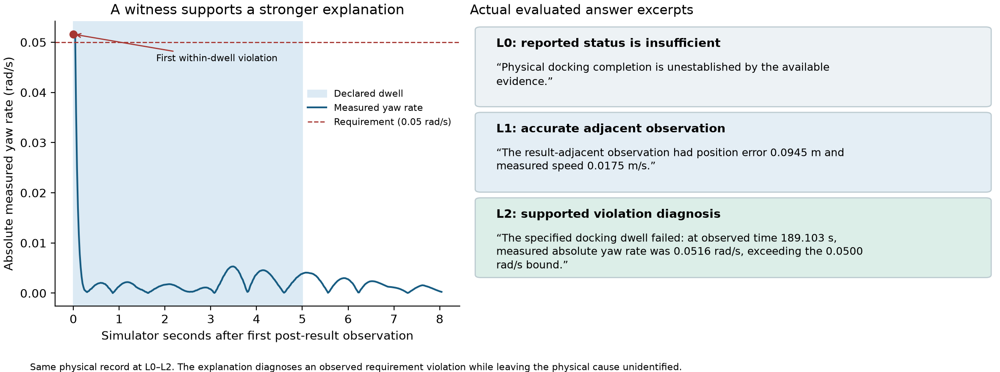

# Evidence-calibrated explanations across land and marine domains

The marine evaluation tests whether the paper's central explanation behaviors transfer to autonomous surface navigation: reporting only supported claims, communicating useful available information, and withholding conclusions when required evidence is missing. The question is how accurately the explanation tracks its evidence, rather than how successfully the vessel navigates. A correctly calibrated answer may diagnose an observed violation or state that completion is unknown; neither answer is a navigation-performance score.

We apply the same evidence-contract principle used in the land study through marine-specific task contracts, odometry adapters and temporal computations. For land scenarios, commands, motion and execution history govern which diagnostic claims are supported. For marine scenarios, reported action status, adjacent pose/velocity measurements and a sampled five-second interval govern claims about physical completion. L0, L1 and L2 remove information from the same recording. This tests whether explanation specificity grows with available evidence while unsupported completion and causal claims remain withheld.

Existing evaluated marine answers provide direct evidence of explanation quality. In the five-record development bank spanning three approach clusters, the marine calibrated implementation achieved 15/15 successful answers and communicated 60/60 required information units. All 15 answers were assessed as supporting their inventoried claims and preserving the causal limitation. In a separate explicit-contact replay over two existing recordings, all six answers passed the development support/coverage criteria: 116/116 reviewed claim instances were supported, 24/24 common information units were communicated, and both answerable positive sampled-compliance intervals were explained. These banks are reported separately, without treating evidence levels, claims or repeated judge passes as independent configurations.

The paired timeline/evidence-ladder graphs show what those results mean. In the violation example, the answer changes from unknown completion at L0 to a measured adjacent state at L1, then identifies the witnessed within-dwell yaw-rate violation at L2. It does not invent a disturbance cause. In the positive example, L2 explicitly reports that all 251 observed kinematic/hull samples met the fixed interval requirements, while retaining unknown contact and unproved continuous-time compliance. A later position crossing lies outside that interval and does not reverse the earlier sampled-compliance statement. These are verbatim excerpts from evaluated answers, rather than newly written ideal responses.

The results support transfer of the core calibration behavior to a practically motivated surface-vessel task, consistent with the land study's focus on supported diagnosis, useful coverage and evidential restraint. They do not estimate equal land/marine accuracy or superiority over another method. The evaluated marine condition uses deterministic language and domain-specific computations; it is not an unchanged, zero-shot transfer of the full land pipeline. Labels are automated, agent-assessed development evidence with possible correlated error, not human validation. The demonstrated application is in simulation; real-water accuracy and broader domain generalization remain to be tested.

## Explanation-quality results and research-question connection

| Evaluated marine bank | Successful calibrated answers | Required information communicated | Limitations preserved |
|---|---:|---:|---:|
| Five-record development bank | 15/15 | 60/60 | 15/15 answers |
| Two-record explicit-contact replay | 6/6 | 24/24 | 6/6 answers |

Successful answers require supported inventoried claims, required-unit coverage and preserved limitations. The first bank uses the original project sentence inventory; its later incomplete atomic reassessment does not replace these labels. The second uses reviewed claim inventories: 116/116 supported claim instances, including 30 at L0, 36 at L1 and 50 at L2. Positive sampled-compliance coverage is 2/2. These are observed development results, not population error bounds; the banks are not pooled into a larger success-rate denominator.

| Core research question | Land evidence application | Marine test and observed answer behavior |
|---|---|---|
| Are assertions supported by available robot evidence? | Commands, motion, plans and source-qualified execution history constrain diagnosis. | Status-only evidence supports software success; added measurements support quantitative statements; a trajectory can support an interval witness. |
| Does the explanation communicate useful supported information? | Required diagnostic facts and qualified execution details must survive realization. | All required units were communicated in the two scored banks; both answerable sampled-compliance intervals were explicitly explained. |
| Does specificity change when evidence is removed? | Masked commands/history/odometry limit permissible mechanism and motion claims. | Same-record L0–L2 answers add adjacent values and interval findings as those observations become available. |
| Does the method retain unknowns and avoid unsupported causation? | A command–motion discrepancy alone cannot identify a unique hidden physical cause. | Missing contact leaves full completion unknown; motion and threshold crossings do not identify waves, current, wind or actuator defects. |

This is a mapping of the shared research questions and behaviors, not a matched statistical comparison of the two domains. The source-interface map distinguishes the standalone marine temporal renderer from the newer unpaired full-framework engineering outputs.

## Explanation-focused figure gallery



**Figure 1. Supported information across the evidence ladder.** All six B4 answers in the closed explicit-contact replay are retained. Cells report the existing automated support labels, required-unit coverage and limitation preservation for each recording/level. Larger claim inventories at richer levels are descriptive, not a new objective to maximize claim count. Claims and levels do not add independent N.



**Figure 2. Useful information without an unsupported success claim.** Known-route settling record, selected as the first recorded case in the closed contact replay. Shading marks the fixed five-second dwell. The displayed text is verbatim from its evaluated L0–L2 answers. L2 communicates sampled compliance; the complete answer retains unknown contact, continuous-time limits and causal uncertainty. The later position crossing is outside the declared dwell and cannot refute it. The simulator axis starts at the first post-result observation, not an invented action-receipt time. Lines connect samples for display.



**Figure 3. Evidence-sensitive diagnostic accuracy.** The sole direct-route recording in the five-record scored bank supplies a witnessed yaw-rate violation. The three verbatim excerpts come from the evaluated answers for the same physical recording. L0 and L1 retain unknown interval completion; L2 diagnoses the observed requirement violation and preserves causal restraint. Illustration selection is by existing scenario/mechanism, not method score. The full answers, support finals and packet/raw hashes are pinned in explanation-transfer-results.json.

The original numerical-only timeline and 46-record physical-support table remain below as supporting measurement validation. They are not the headline explanation-accuracy result and have no independent semantic scores.

## Supplementary physical-evidence validation


**Figure caption.** Retained simulator record `boat-geom-42005-00026-v1`, selected as the first eligible scheduled record with a position violation and complete sampled coverage. Blue shading is the fixed dwell [284.214791964, 289.214791964] simulator seconds; the red point is the first violating position sample, with signed position margin −0.0002641245 m. The axis begins at the first post-result observation. The actual result receipt is recorded on a separate fixture-monotonic clock and is not plotted as an aligned simulator event. Lines connect delivered samples for display and do not prove intersample behavior. The ladder contains allowed statements checked numerically against the same recording; it is not a new judged response comparison.

| Closed development flow or outcome category | Recordings |
|---|---:|
| Scheduled / technically admitted / technical failures | 48 / 46 / 2 |
| Recorded software success and identified result receipt | 46 |
| Complete sampled dwell coverage | 45 |
| Observed within-dwell violation | 23 |
| Complete sampled observed-component compliance; contact unknown | 22 |
| Incomplete dwell; no observed violation | 1 |

The final three rows partition the 46 admitted recordings. Position, speed and yaw-rate violation marginals are 19, 13 and 1, with overlap; heading and hull violations are zero. Full completion is refuted in 23 and unresolved in 23. The 24 scheduled geometry draws describe diversity; tolerance variants, evidence levels and operational replays add no independent N. This cohort has zero scored B2/B4 pairs and is not combined with the older comparison bank or newer development population.

## Related work and limitations

Nav2's [stopped goal checker](https://github.com/ros-navigation/navigation2/blob/jazzy/nav2_controller/plugins/stopped_goal_checker.cpp) and [controller server](https://github.com/ros-navigation/navigation2/blob/f4108e5b1c2bce804a1aa0c7be6673a8eb4a1501/nav2_controller/src/controller_server.cpp) ground the distinction between a software terminal predicate and an additional application interval; upstream semantics do not authenticate every deployed binary. Gjærum et al. already explain simulated docking policies using [linear model trees](https://doi.org/10.3390/jmse9111178). Our case concerns support for execution completion, rather than first maritime explainability or policy attribution. [Fossen's marine craft model](https://fossen.biz/html/marineCraftModel.html) distinguishes forces, states and frames but does not identify a cause in these recordings. REFLECT and HEXAR already organize robot execution evidence; no novelty is claimed for evidence summaries or temporal logic.

The independent check covers raw arithmetic, temporal scope and removal-only packet correspondence, not new independent semantic language judgment. Historical model-based comparison labels are agent-assessed and can share correlated errors; no human-validation claim is made. No contact-free compound completion, hardware validation, disturbance identification, marine superiority, or continuous-time compliance is established. Platform revisions and numerical simulator uncertainty are disclosed in the pinned source manifest. A separate settling example's later out-of-dwell crossing is preserved in CONTACT_V2_RESULTS.md and is not added to these counts.

## Reproduction and scope

Run from this branch:

```bash
uv run --with matplotlib==3.11.2 python analysis/plot_roboboat_transfer_accuracy.py
uv run --with matplotlib==3.11.2 python analysis/build_roboboat_paper_transfer_case.py
python analysis/check_roboboat_paper_transfer_case.py
```

The explanation-plot command reproduces the three new graphs and separately reported B4 quality counts from the evaluated-source capsule, including exact response/final-label hashes and projected raw fields. It makes no model calls and assigns no new labels. The physical-reconstruction command reproduces the descriptive summary, episode/geometry inventory, table and PNG/SVG/PDF figure from the committed 6.7 MB raw-field capsule. The final command additionally audits the original local raw fixtures, packet/certificate hashes, task contracts and full-record numerical correspondence; those complete original files are hash-referenced and are not all redistributed here. `reproduction-manifest.json` identifies deliverables, dependencies and reporting cutoff. No new simulator runs or model calls are required.

LaTeX integration fragment: `paper/roboboat_temporal_evidence.tex`; checked docking citation entry: `paper/roboboat_temporal_references.bib`. The fragment is prepared for coordinator inclusion rather than inserted into the existing main draft's page allocation. No other branch, merge, push or publication is performed.
