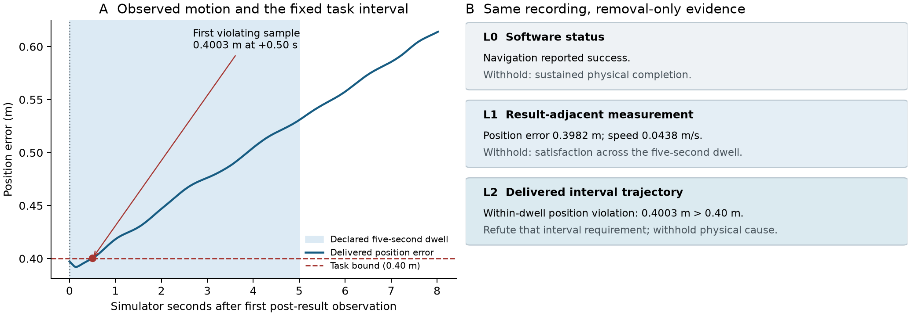

# Temporal evidence in simulated surface navigation

We apply the same evidence-contract principle to simulated surface navigation, where navigation-software success and interval-qualified physical task completion are distinct propositions. Removal-only evidence conditions distinguish reported status, instantaneous measurements, and sampled post-result behavior, while preserving unknown conditions rather than upgrading them into successful docking. This applies the paper's truth-versus-support distinction to a different embodiment using marine-specific adapters and computations; it is not zero-shot transfer of an unchanged land implementation.

The separate application contract fixes a five-second dwell beginning at the first delivered post-result odometry observation. Requirements are position error at most 0.40 m, wrapped heading error at most 0.35 rad, measured translational speed at most 0.05 m/s, absolute yaw rate at most 0.05 rad/s, an oriented hull within a declared berth, and absence of prohibited contact. Nav2's stopped goal checker evaluates pose and instantaneous velocity conditions; its terminal success does not certify this additional dwell or contact requirement. A mismatch with the stricter application contract is therefore not evidence of a navigation-stack bug.

We fixed the entire closed development collection before independently recomputing its descriptive findings from raw delivered odometry and declared contracts. All 48 scheduled attempts are retained: 46 technically admitted recordings and two technical failures, spanning 24 geometry draws with two tolerance variants each and 22 fully admitted pairs. All 46 admitted recordings contain an identified action-success receipt. Forty-five cover the sampled dwell under the declared 0.06 s maximum-gap rule. Twenty-three contain a required-condition violation inside the fixed dwell; 22 satisfy all observed kinematic/hull checks over the sampled interval but lack contact coverage; one has incomplete coverage and no observed violation. Contact is unknown throughout. These are retained-development counts, not population prevalence, a navigation-error rate, or explanation accuracy.

The linked timeline and evidence ladder use one recording. Its result-adjacent position error is 0.3982 m and measured speed is 0.0438 m/s. Within the declared dwell, a sample at simulator time 284.7148 s has position error 0.400264 m, exceeding the bound. L0 supports reported navigation success; L1 adds the bounded adjacent measurements; L2 supplies a witness refuting the interval requirement. The plot anchors at the first post-result observation, not an invented simulator timestamp for the client receipt. Sampled satisfaction cannot establish continuous compliance without intersample bounds, and observed motion cannot uniquely identify waves, current, wind, or actuator defects.

Existing separate, inspected B2/B4 comparisons tied useful coverage: both communicated all 24 common units and both answerable sampled-compliance intervals. The strict 5/6 versus 6/6 contact-replay scores hinge on a roughly 0.000145 m temporal-reference discrepancy and do not establish material superiority. Recent deterministic-output checks establish numerical/contract conformance, not independently judged language correctness. This subsection supports a reproducible application of the evidence-calibration principle and descriptive simulator behavior; comparative effectiveness and hardware transfer remain unestablished.

## Figure and table



**Figure caption.** Retained simulator record `boat-geom-42005-00026-v1`, selected as the first eligible scheduled record with a position violation and complete sampled coverage. Blue shading is the fixed dwell [284.214791964, 289.214791964] simulator seconds; the red point is the first violating position sample, with signed position margin −0.0002641245 m. The axis begins at the first post-result observation. The actual result receipt is recorded on a separate fixture-monotonic clock and is not plotted as an aligned simulator event. Lines connect delivered samples for display and do not prove intersample behavior. The ladder contains allowed statements checked numerically against the same recording; it is not a new judged response comparison.

| Closed development flow or outcome category | Recordings |
|---|---:|
| Scheduled / technically admitted / technical failures | 48 / 46 / 2 |
| Recorded software success and identified result receipt | 46 |
| Complete sampled dwell coverage | 45 |
| Observed within-dwell violation | 23 |
| Complete sampled observed-component compliance; contact unknown | 22 |
| Incomplete dwell; no observed violation | 1 |

The final three rows partition the 46 admitted recordings. Position, speed and yaw-rate violation marginals are 19, 13 and 1, with overlap; heading and hull violations are zero. Full completion is refuted in 23 and unresolved in 23. The 24 scheduled geometry draws describe diversity; tolerance variants, evidence levels and operational replays add no independent N. This cohort has zero scored B2/B4 pairs and is not combined with the older comparison bank or newer development population.

## Related work and limitations

Nav2's [stopped goal checker](https://github.com/ros-navigation/navigation2/blob/jazzy/nav2_controller/plugins/stopped_goal_checker.cpp) and [controller server](https://github.com/ros-navigation/navigation2/blob/f4108e5b1c2bce804a1aa0c7be6673a8eb4a1501/nav2_controller/src/controller_server.cpp) ground the distinction between a software terminal predicate and an additional application interval; upstream semantics do not authenticate every deployed binary. Gjærum et al. already explain simulated docking policies using [linear model trees](https://doi.org/10.3390/jmse9111178). Our case concerns support for execution completion, rather than first maritime explainability or policy attribution. [Fossen's marine craft model](https://fossen.biz/html/marineCraftModel.html) distinguishes forces, states and frames but does not identify a cause in these recordings. REFLECT and HEXAR already organize robot execution evidence; no novelty is claimed for evidence summaries or temporal logic.

The independent check covers raw arithmetic, temporal scope and removal-only packet correspondence, not new independent semantic language judgment. Historical model-based comparison labels are agent-assessed and can share correlated errors; no human-validation claim is made. No contact-free compound completion, hardware validation, disturbance identification, marine superiority, or continuous-time compliance is established. Platform revisions and numerical simulator uncertainty are disclosed in the pinned source manifest. A separate settling example's later out-of-dwell crossing is preserved in CONTACT_V2_RESULTS.md and is not added to these counts.

## Reproduction and scope

Run from this branch:

```bash
uv run --with matplotlib==3.11.2 python analysis/build_roboboat_paper_transfer_case.py
python analysis/check_roboboat_paper_transfer_case.py
```

The first command reproduces the descriptive summary, episode/geometry inventory, table and PNG/SVG/PDF figure from the committed 6.7 MB raw-field capsule. The second additionally audits the original local raw fixtures, packet/certificate hashes, task contracts and full-record numerical correspondence; those complete original files are hash-referenced and are not all redistributed here. `reproduction-manifest.json` identifies deliverables, dependencies and reporting cutoff. No new simulator runs or model calls are required.

LaTeX integration fragment: `paper/roboboat_temporal_evidence.tex`; checked docking citation entry: `paper/roboboat_temporal_references.bib`. The fragment is prepared for coordinator inclusion rather than inserted into the existing main draft's page allocation. No other branch, merge, push or publication is performed.
