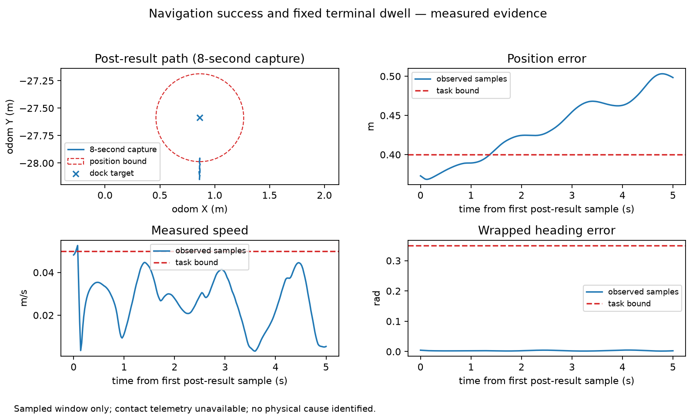
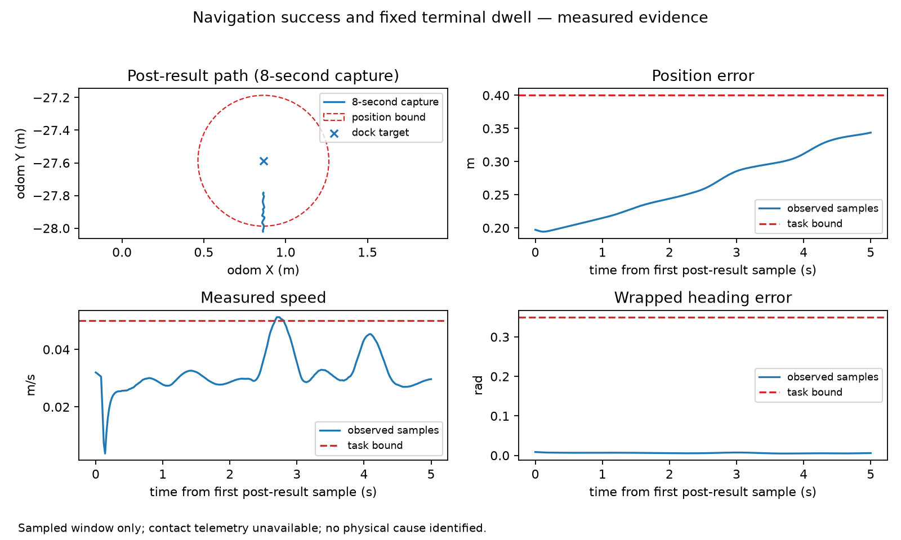

# Executed marine development results

The strong tool agent and deterministic marine contract condition tied on the completed development comparison. This is agent-assessed feasibility evidence, not superiority or human validation. Historical replay is not fresh; the two fresh physical recordings constitute one paired approach cluster. The pilot stopped at a third capture's strict technical failure, preserving four physically untouched rows under the pilot allocation. No confirmatory alpha or pooled land N is used.

| Recording | B2 answer success | Marine B4 answer success | B2 required units | Marine B4 required units |
|---|---:|---:|---:|---:|
| boat-terminal-pilot-001 | 3/3 | 3/3 | 12/12 | 12/12 |
| boat-terminal-pilot-002 | 3/3 | 3/3 | 12/12 | 12/12 |
| historical-replay | 3/3 | 3/3 | 12/12 | 12/12 |

All 18 answers have complete two-pass support annotations and finalized blinded handoffs before the result join. Each answer's conjunctive development score requires all inventoried statements supported, all four required communication units covered, and the causal limitation preserved. Exact-sentence project inventories are explicitly development provenance, not the land atomization/role pipeline or a confirmatory atomic endpoint. The marine qualification passed 8/8 construction-defined held-out cases in each isolated pass with field accuracy 1.0; judges used the unchanged current Astra/high support prompt and schemas. No human annotation was collected.

The independent references agree with the certificate support and all checked position/time witnesses. The rounded value/unit audit passed for all 18 answers; it does not by itself verify number-to-event association or temporal/modality language. Those are assessed on the full evidence packet. There were no annotation disagreements requiring agent adjudication in this completed comparison.

The observed fresh-cluster B4-minus-B2 mean-success difference is 0.0. With one independent paired cluster, comparative uncertainty and power cannot be responsibly estimated; no p-value or confidence interval is promoted. A tie is retained. We do not weaken the agent, invent difficult wording, or select a population from its failures.

B2 used the same executable certificate/renderer code and produced additional supported details; median answer length was 106 words versus 52 for the deterministic condition. B2 median top-level CLI latency was 56.8 s (range 51.2–77.1 s). The deterministic method makes zero model calls. Its wall latency was not instrumented in this comparison, so no numeric latency ratio is claimed. Monetary cost was not reported by the login-backed CLI. Optional/supplemental useful coverage was not independently quantified; both methods' required-unit scores do not imply identical detail coverage.

## Evidence-rich replay

| Evidence | Supported final language |
|---|---|
| L0: reported action success + public task/config | Physical docking completion is unestablished. |
| L1: add result-adjacent odometry | Error 0.3738 m and measured speed 0.0486 m/s; instantaneous observations do not establish the dwell. |
| L2: add post-result trajectory | Observed error 0.4004 m at 239.040 s exceeds the 0.4000 m requirement within the fixed dwell. |

The historical remaining position margin was 0.02619 m. Its full eight-second endpoint error was 0.56138 m; observed radial growth was 0.18757 m, distinct from net displacement 0.18760 m and traveled arclength. Its event receipt time/UUID remain unavailable; first post-result sample time is not presented as the action return. New capture retains actual client event identity/receipt clock and the separately stamped latest odometry snapshot.

The path panel uses the full eight-second post-result capture; pose/motion traces show the declared first five seconds. A supported point violation establishes failure despite unavailable contact evidence. No plotted motion is an identified wave/current/wind cause.

## Fresh records and stopped pilot

Row 001 (internal XY 0.20 m) returned success with error 0.19781 m; its fixed dwell had a measured speed violation. Row 002 (internal XY 0.40 m) returned success with error 0.37638 m; its fixed dwell had a position violation. Strict RTF was 1.00006 and 1.00008, respectively. Their retained endpoint outcomes and any original evaluator success are not substitutes for the separately declared fixed-dwell task.

Row 003 returned navigation success but strict capture failed with one rejected/stale action and five stale observations. There were zero observation failures and zero invalid-water queries, but the strict rule was not weakened. It contributes no valid paired endpoint. Queue stopped with rows 004–006 untouched; no successful replacement was collected. Fresh diversity and reliable throughput remain open feasibility gates before another prospectively declared pilot or confirmation.

## Limits and next gate

No real robot-visible contact stream, continuous-time bound, calibrated stopping prediction, unique physical-cause observer, or hardware validation is supplied. The original validated docking/controller/physics/assets remain unchanged. Future work should diagnose the capture-quality failure and retain actual node/plugin runtime parameter queries, then prospectively declare any successor attempts without recycling failed requests or inspected configurations as fresh confirmation. Complete marine annotation artifacts, commands, registry, references and method outputs are retained in the isolated immutable development capsule for coordinator integration. Confirmation remains closed pending explicit program error-budget disposition and a frozen untouched design.
